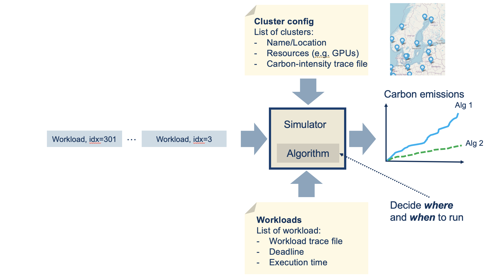

# CarbonSim

CarbonSim is a **discrete-event simulator** for modeling **carbon emissions** in a **cloud-edge continuum**, developed as part of the [COGNIT](https://cognit.2i2.eu/) Sovereign Edge EU initiative.



The simulator **replays real GPU workloads** from the [MIT Supercloud dataset](https://arxiv.org/abs/2108.02037) using **carbon intensity traces** obtained from [ElectricityMap](https://api.electricitymap.org/) to estimate the carbon emissions released when executing workloads across geographically distributed edge clusters.

This enables the evaluation of **carbon-aware scheduling and optimization algorithms** — such as spatial placement, time-shifting, and reservation-based planning — to explore strategies for **reducing carbon emissions** in distributed computing infrastructures.

## Features

- **Multi-cluster simulation** across European edge locations with real carbon intensity data
- **Four scheduling algorithms**: greedy, random, reservation (with configurable lookahead), and greedy bin-packing
- **Real workload replay** using GPU power traces from the MIT Supercloud dataset (~100,000 jobs)
- **Carbon intensity traces** for 76 European electricity zones at 1-second resolution
- **Per-tick metrics**: cumulative CO2 emissions (g), energy consumption (kWh), GPU utilization (%), and GPU cost
- **Jupyter notebooks** for analysis and visualization of simulation results

## Project Structure

```
.
├── simulator/                  # Core simulator modules
│   ├── simulator.py            # Main simulation orchestrator
│   ├── scheduler.py            # Scheduling algorithms (greedy, random, reservation, binpack)
│   ├── edge_cluster.py         # Edge cluster model with carbon tracking
│   ├── process.py              # Workload/process model
│   ├── reservation.py          # Reservation-based scheduling strategy
│   ├── priority_pool.py        # Process priority queue
│   └── experiments/            # Pre-configured experiment scripts
│       ├── 100_single/         # Single-cluster experiments
│       └── 100_small/          # Multi-cluster experiments
├── scripts/
│   ├── carbon/                 # Carbon intensity data pipeline
│   ├── workflows/              # Workload generation pipeline
│   └── edgeclusters/           # Edge cluster config utilities
├── carbon/                     # Carbon intensity CSVs (76 European zones)
├── notebooks/                  # Jupyter notebooks for analysis and visualization
├── ideas/                      # Optimization algorithm prototypes (MILP, genetic, annealing, RL)
├── edge-clusters*.json         # Edge cluster configurations
└── european_zones.csv          # European electricity zone metadata
```

## Scheduling Algorithms

| Algorithm | Description |
|-----------|-------------|
| **greedy** | Selects the cluster with the lowest current carbon intensity |
| **random** | Randomly assigns workloads to available clusters |
| **reservation** | Plans process placement in advance using future carbon intensity forecasts (6h, 12h, 24h lookahead windows) |
| **greedy_binpack** | Prioritizes processes by power draw and deadline, then applies greedy placement |

The `reservation` algorithm supports **time-shifting**, where workloads are delayed to periods with lower carbon intensity. The `timepacking` flag can disable time-shifting to evaluate **spatial placement only**.

## Dataset Generation

Below are instructions for generating a CarbonSim-compatible dataset.
If you prefer not to generate the dataset yourself, a pre-generated version (~100 GB) is available upon request — contact **Johan Kristiansson** at [johan.kristiansson@ltu.se](mailto:johan.kristiansson@ltu.se).

The simulator requires four input components:

1. **Workloads** — per-second GPU power traces
2. **Workload Replay Logs** — a predefined sequence indicating the order and timing of workload submissions
3. **Carbon intensity traces** — time-series carbon intensity data per electricity zone
4. **Edge cluster configuration** — cluster locations, GPU capacity, and associated carbon intensity files

### Workload Dataset and Replay Log

1. Download the MIT Supercloud dataset from [https://dcc.mit.edu/data](https://dcc.mit.edu/data). Note that the full dataset is 2.4 TB.
```console
aws s3 cp s3://mit-supercloud-dataset/datacenter-challenge datacenter-challenge --recursive --no-sign-request
```
2. Run the following scripts to generate a CarbonSim-compatible dataset:
```console
python3 ./scripts/workflows/1_generate_workloads.py
python3 ./scripts/workflows/2_filter_workflows.py
python3 ./scripts/workflows/3_resample_workloads_cvs.py
python3 ./scripts/workflows/4_generate_workload_stat.py
python3 ./scripts/workflows/5_generate_max_waittime.py
python3 ./scripts/workflows/6_generate_summary.py
```

> **Note:** The scripts contain hardcoded paths that need to be updated:
> ```python
> slurm_csv_file_path = '/scratch/datasets/datacenter-challenge/202201/slurm-log.csv'
> app_csv_file_path = '/scratch/datasets/datacenter-challenge/202201/labelled_jobids.csv'
> base_dir = '/scratch/datasets/datacenter-challenge/202201/gpu'
> output_dir = './workloads'
> ```

3. Generate a replay log:
```console
python3 ./scripts/workflows/7_generate_log.py --wait 80 --num_logs 100 --source_directory filtered_workloads_1s --target_directory ./80_logs
```

The `--wait` parameter controls the inter-arrival time between workload submissions, sampled from an **exponential distribution**:
- A **higher value** results in shorter average wait times (more frequent submissions)
- A **lower value** leads to longer intervals between jobs

### Carbon Intensity Dataset

Use the script `scripts/carbon/1_fetch_co2_data.py` to fetch carbon intensity time-series data from [ElectricityMap](https://api.electricitymap.org/).

The repository includes pre-collected carbon intensity traces for several months in 2024, located in the `./carbon` directory.

To make the data compatible with the simulator, resample it to 1-second resolution:
```console
python3 ./scripts/carbon/2_resample_carbon_cvs.py
python3 ./scripts/carbon/3_trim_carbon_1s_30d.py
```

> **Note:** The scripts contain hardcoded paths that must be updated:
> ```python
> input_dir = './carbon'
> output_dir = './carbon_1s'
> ```

### Edge Cluster Configuration

Utility scripts for creating edge cluster configurations:
```console
python3 ./scripts/edgeclusters/generate_edgecluster_cost.py
python3 ./scripts/edgeclusters/generate_european_zones.py
```

The simulator requires an edge cluster configuration in JSON format:
```json
[
    {
        "name": "Lulea",
        "nodes": 2,
        "gpus_per_node": 8,
        "carbon-intensity-trace": "./carbon_1s/SE-SE1.csv",
        "gpu_cost_euro_per_second": 0.001094
    },
    {
        "name": "Stockholm",
        "nodes": 2,
        "gpus_per_node": 8,
        "carbon-intensity-trace": "./carbon_1s/SE-SE3.csv",
        "gpu_cost_euro_per_second": 0.001101
    }
]
```

Several pre-configured cluster setups are included: `edge-clusters-single.json` (baseline), `edge-clusters-small.json`, `edge-clusters-large.json`, and `edge-clusters.json` (full 34-cluster European deployment).

## Running a Simulation

Create a script similar to the examples in `./simulator/experiments/`:

```python
import sys
sys.path.append('../../simulator')

from simulator import Simulator

max_processes = 10000
max_days = 2000
workload_dir = "./filtered_workloads_1s"
workloads_stats_dir = "./filtered_workloads_1s_stats"
cluster_config = "./edge-clusters-single.json"
log_dir = "./logs/100"
log_file = "log_2.csv"

alg = "greedy"
results_dir = "./results/100_single/greedy"
power_threshold = 150       # watts
process_maxwait = 60 * 2    # seconds
co2_intensity_threshold = 160

def main():
    simulator = Simulator(alg,
                          power_threshold,
                          process_maxwait,
                          co2_intensity_threshold,
                          max_processes,
                          max_days,
                          log_dir,
                          log_file,
                          workload_dir,
                          workloads_stats_dir,
                          cluster_config,
                          results_dir)
    simulator.start()

if __name__ == "__main__":
    main()
```

### Output

The simulator produces trace files in the results directory:

```
results/100_single/greedy/
├── scheduler.csv       # Global metrics (emissions, energy, utilization, cost)
├── Lulea.csv           # Per-cluster utilization metrics
├── London.csv
└── Warsaw.csv
```

The `scheduler.csv` file contains per-tick information about energy consumption, carbon emissions, GPU utilization, and total GPU cost:

| tick | cumulative_emission | cumulative_energy | utilization | total_gpu_cost |
|------|---------------------|-------------------|-------------|----------------|
| 0    | 0.000000            | 0.000000          | 0.000000    | 0.000000       |
| 1    | 0.000945            | 0.000008          | 0.000156    | 0.001094       |
| 2    | 0.001891            | 0.000016          | 0.000156    | 0.002188       |
| 3    | 0.002836            | 0.000024          | 0.000156    | 0.003282       |

## Analysis Notebooks

The `./notebooks` directory contains Jupyter notebooks for post-processing and visualizing simulation results:

| Notebook | Description |
|----------|-------------|
| `AlgComparisonSingle.ipynb` | Compare scheduling algorithms on a single cluster |
| `AlgComparisonSmall.ipynb` | Compare algorithms on multi-cluster setups |
| `EdgeClusterStats*.ipynb` | Per-cluster emission and utilization statistics |
| `PlotCarbonIntensity.ipynb` | Carbon intensity time-series across European zones |
| `PlotJobLength.ipynb` | Workload duration distributions |
| `PlotJobSubmissionFreq.ipynb` | Job inter-arrival time analysis |
| `CO2Calc.ipynb` | Step-by-step carbon emission calculation methodology |

## Acknowledgements

This work has been funded by the European Union COGNIT project (Horizon Europe, Grant Agreement No. 101092711). Views and opinions expressed are those of the authors and do not necessarily reflect those of the European Union. Neither the European Union nor the granting authority can be held responsible for them.
